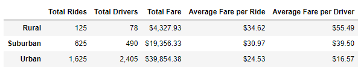
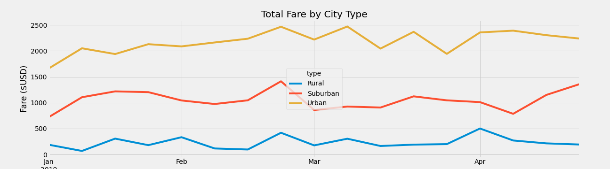
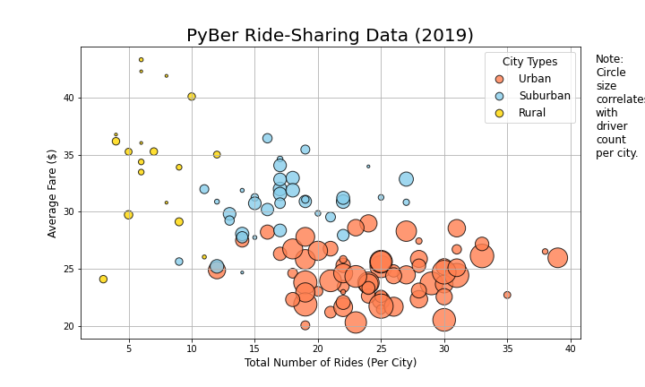

# PyBer_Analysis
Using Matplotlib in combination with Pandas and NumPy to analyse ridesharing data
## Overview of the analysis
Pyber a ride-sharing start-up wants us to perfrom some exploratory analysis. During the course of this analysis I used **matplotlib, pandas, and numpy** to understand the relationships between the type of city, the total rides, total drives, average fare per ride and per driver.  

I also used statistics and scatterplots to understand the data better the exercise is about providing business recommendations based on this data.

## Results
### Key Metrics by type

As part of the challenge, I used groupby function to first create a dataframe which provided all the relevant data grouped by city type as shown below  

```python
pyber_summary_df=pd.DataFrame(
                {"Total Rides": total_ride_count,
                 "Total Drivers": total_driver_count,
                 "Total Fare": total_fare,
                 "Average Fare per Ride": average_fare_ride,
                 "Average Fare per Driver": average_fare_driver})
pyber_summary_df
```
The output of this code-snippet after removing the type index value is showcased below  
  

As you can see from the above
1. Rural areas have a higher per/ride and per/driver fare compared to the suburban and urban cities
    - This could be due to rural riders taking longer trips and fewer number of drivers available in these markets
2. I the urban cities, there are more drivers than total rides taken
    - This is a huge opportunity for us to invest in marketing and customer acquisition to grow our userbase in these markets
3. Suburban markets are a happy middle, with a relatively high fare/driver. This allows us to recruit more drivers in these markets

### Total Fare by city type

The time-series line chart is shown below

  

Each city type has different characteristics, however one of the commonalities here is that **January is a low month across all 3 city types**  
Other insights
- 3rd week of february sees the first spike across all markets
- Urban markets fluctuate a lot from mid-feb to late-March

## Recommendations to the CEO
1. **Recommendation 1:Invest in customer acquisition and marketing in the urban areas.**  
    - There are more drivers than rides, which provides us an opportunity to get more customers in these markets
    - The average fare per driver is also very low here, which means some drivers may not be completely utilised and this needs to be corrected
2. **Recommendation 2: Plan for peak traffic(i.e introcuding surge pricing and driver incentives) in rural areas**
    - Rural riders take longer rides and there are fewer drivers to serve them. 
3. **Recommendation 3: Acquire new drivers in suburban areas where there are a high number of rides**
    - Certain suburban areas have high number of rides similar to urban areas, these areas need to be groomed for better revenue generation. (figure below)
 
 
- 


